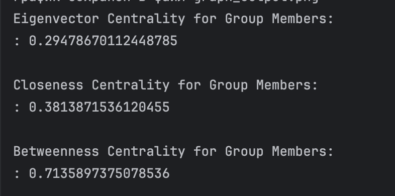

### Анализ социальной сети ВКонтакте с использованием Python и сетевых метрик

---

## Описание проекта

Этот проект позволяет анализировать социальные связи пользователей ВКонтакте (VK) с помощью графовых алгоритмов и визуализации. Программа собирает данные о друзьях пользователей через API VK, строит граф друзей, вычисляет центральности узлов и визуализирует сеть.

---

## Возможности

1. **Сбор данных**:
   - Получение списка друзей пользователей.
   - Построение сети "друзья друзей" с ограничением на количество друзей.

2. **Анализ сети**:
   - Расчёт метрик центральности:
     - **Eigenvector Centrality**: влияние узла в сети.
     - **Closeness Centrality**: близость узла к другим.
     - **Betweenness Centrality**: роль узла в соединении других узлов.

3. **Визуализация графа**:
   - Использование алгоритма Kamada-Kawai для удобного размещения узлов.
   - Кодирование размеров и цветов узлов в зависимости от центральностей.

---

## Технологии

- **Python**: основной язык разработки.
- **Библиотеки**:
  - `requests`: для работы с API ВКонтакте.
  - `networkx`: для построения и анализа графа.
  - `matplotlib`: для визуализации.

---

## Установка

### Требования

- Python 3.8 или выше.
- Необходимые библиотеки:
  ```bash
  pip install requests networkx matplotlib
  ```

## Использование

1. Укажите логины пользователей для анализа:
   ```python
   usernames = ['example_user1', 'example_user2']
   ```

2. Запустите скрипт:


3. Результаты:
   - Визуализированный граф сети.
    
     
    
  - Центральности узлов в консоли:
    
    

---

## Пример результата

### Граф связей

Граф отображает связи между пользователями и их друзьями. Узлы крупнее и ярче указывают на пользователей с высокой центральностью.

### Центральности

- **Eigenvector Centrality**: отражает влияние пользователя.
- **Closeness Centrality**: показывает, насколько пользователь близок к другим в сети.
- **Betweenness Centrality**: определяет пользователей, через которых проходят связи других.

---

## Ограничения

1. API ВКонтакте ограничивает количество запросов, поэтому могут быть пропуски данных.
2. Пользователи с приватными настройками профиля не будут включены в анализ.
3. Граф может стать слишком сложным для больших сетей — рекомендуется уменьшить `FRIENDS_LIMIT`.

---

## Возможные улучшения

**Оптимизация запросов**:
  - Добавить многопоточность для ускорения получения данных.
  - Улучшить обработку ошибок при достижении лимитов API.
